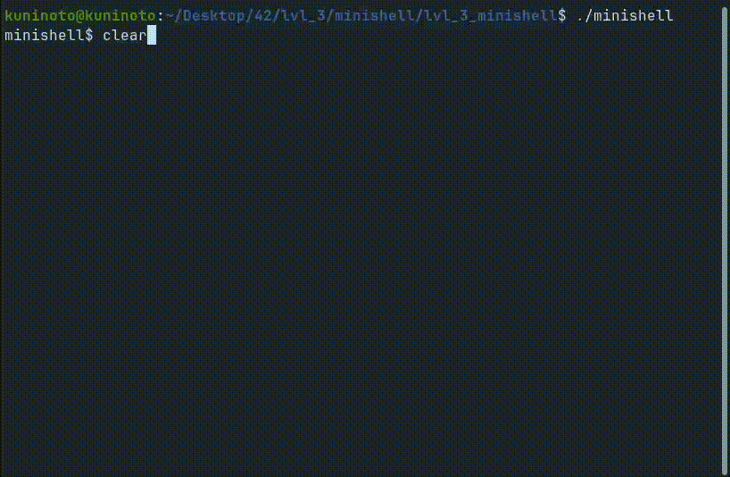

# minishell (42Porto - 42Cursus)  

#### Project done in collaboration with [Rodrigo Ramos](https://github.com/ramos21rodrigo)  

### Demonstration  

## Description  

Basic shell that replicates core functionalities of [bash](https://www.gnu.org/software/bash/).

## Features

- Handle command execution from relative, absolute and paths taken from `PATH`;
- Handle `$?`;
- Handle SIGINT and SIGQUIT signals; 
- Environment variables;
- Command history;
- Quotes (both single and double) support;
- I/O Redirections support;
- Pipe support;
- Builtin commands: `echo`, `cd`, `pwd`, `export`, `unset`, `env` and `exit`

## Grade: 101/100  

### Installing and running the project  
1- Install dependencies:  

	sudo apt-get install make libreadline-dev
2- Clone this repository:  

	git clone https://github.com/Kuninoto/42_minishell minishell
3- Navigate to the project's folder

	cd minishell
4- Compile and wipe the object files that you won't need anymore  

	make && make clean
5- Run minishell

	./minishell

#### Makefile available targets  
`make` or `make all` - compiles `minishell`  
`make clean` - wipes all object files  
`make fclean` - deletes `minishell` and all object files  
`make re` - `fclean` + `all`  

## Useful links  
Understanding Bash/Shell behavior and related functions:  
[Writing a UNIX shell part 1](https://indradhanush.github.io/blog/writing-a-unix-shell-part-1/)  
[Writing a UNIX shell part 2](https://indradhanush.github.io/blog/writing-a-unix-shell-part-2/)  
[Writing a UNIX shell part 3](https://indradhanush.github.io/blog/writing-a-unix-shell-part-3/)  
[GNU documentation about redirections](https://www.gnu.org/software/bash/manual/html_node/Redirections.html)  
[Shell Program Explained](https://www.youtube.com/watch?v=ubt-UjcQUYg)  
[Tinyshell case study](http://www.cems.uwe.ac.uk/~irjohnso/coursenotes/lrc/system/shell/index.html)  
[Pipes, Forks, & Dups: Understanding Command Execution and Input/Output Data Flow](https://www.rozmichelle.com/pipes-forks-dups/)  
[Open-source alike project](https://github.com/Swoorup/mysh)  

Parsing:  
[Parsing Explained](https://youtu.be/bxpc9Pp5pZM)  
[Parsing](https://youtu.be/r6vNthpQtSI)  
[Functional Parsing](https://www.youtube.com/watch?v=dDtZLm7HIJs)  
[Recursive Descent Parsing](https://www.youtube.com/watch?v=SToUyjAsaFk)  
[Open-source alike project](https://github.com/mit-pdos/xv6-public/blob/master/sh.c)  
[Parsing reference](https://pubs.opengroup.org/onlinepubs/009695399/utilities/xcu_chap02.html)  

Abstract Syntax Tree (AST):  
[Abstract syntax tree on Wikipedia](https://en.wikipedia.org/wiki/Abstract_syntax_tree)  
[How to construct an abstract syntax tree](https://stackoverflow.com/questions/1721553/how-to-construct-an-abstract-syntax-tree)  
[What is an AST?](https://www.twilio.com/blog/abstract-syntax-trees)  

## Disclaimer
> At [42School](https://en.wikipedia.org/wiki/42_(school)), almost every project must be written in accordance to the "Norm", the schools' coding standard. As a result, the implementation of certain parts may appear strange and for sure had room for improvement.

[Shell Code - More Detail](https://www.youtube.com/watch?v=ZjzMdsTWF0U)  
[EnthusiastiCon - Stefanie Schirmer “OMG building a shell in 10 minutes”](https://www.youtube.com/watch?v=k6TTj4C0LF0)  
[execve()](https://www.tutorialspoint.com/unix_system_calls/execve.htm)  
[Signals and traps in UNIX](https://www.geeksforgeeks.org/signals-and-traps-in-unix/)  
[UNIX signals and traps](https://www.tutorialspoint.com/unix/unix-signals-traps.htm)  
[List of terminal generated signals (eg Ctrl-C -> SIGINT)](https://unix.stackexchange.com/questions/362559/list-of-terminal-generated-signals-eg-ctrl-c-sigint#362566)  
[What's a relative path?](https://www.computerhope.com/jargon/r/relapath.htm)  
[What's an absolute path?](https://www.techopedia.com/definition/5817/absolute-path)  
[TERM environment variable (UNIX)](https://www.ibm.com/docs/en/informix-servers/12.10?topic=products-term-environment-variable-unix)  
[What is an environment variable?](https://kinsta.com/knowledgebase/what-is-an-environment-variable/)  
[TERM environment variable not set](https://linuxconfig.org/term-environment-variable-not-set-solution)  
[Writing your own shell](https://www.cs.purdue.edu/homes/grr/SystemsProgrammingBook/Book/Chapter5-WritingYourOwnShell.pdf)  
[Tiny Shell - case 
---
Made by Nuno Carvalho (Kuninoto) | nnuno-ca@student.42porto.com  

 <a href="https://www.linkedin.com/in/nuno-carvalho-218822247"/> &nbsp;
